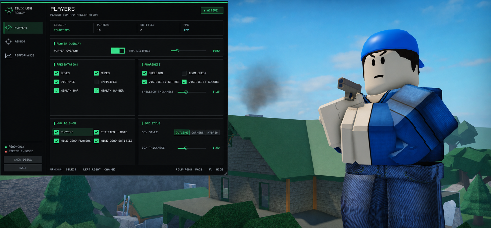

# ZelixLens ROBLOX Edition

**Private, kernel-backed Roblox software for Windows 10/11 x64.**

> [!WARNING]
> **Educational project and user responsibility:** This software is provided
> "as is," without warranties or guarantees. You are responsible for how you
> use it and for following applicable laws, Roblox rules, and the rules of each
> experience you join. Third-party software may result in account or platform
> action. ZelixLens is independent and is not affiliated with Roblox Corporation.

**KERNEL-BACKED · EXTERNAL · READ-ONLY · HIGH-REFRESH OVERLAY**

**Official downloads are available from GitHub Releases and the ZelixLens Discord.**

---

## Preview

Focused player controls, clear presentation options, and a responsive external overlay.

## At a glance

| | ZelixLens ROBLOX Edition |
|---|---|
| **Backend** | Kernel-backed, read-only game-data transport |
| **Operating model** | Separate external application with no Roblox-process injection or memory writes |
| **Player visuals** | Boxes, skeletons, names, distance, health, visibility presentation, and filtering |
| **Controls** | Player presentation, aiming configuration, and performance settings in one interface |
| **Access** | ZelixLens license verification with protected saved-key convenience |
| **Delivery** | Complete customer package with automatic update support |
| **Official sources** | GitHub Releases and the official ZelixLens Discord |

## Why ZelixLens

- **External design** — the overlay and controls run in the separate ZelixLens application.
- **Read-only interaction** — Roblox game data is read without writing to Roblox process memory.
- **Focused presentation** — configure the information you want without crowding the screen.
- **Responsive controls** — player, aim, and performance settings share one consistent interface.
- **Saved access** — an accepted key can be protected for the current Windows account and reused later.
- **Maintained releases** — the customer launcher checks for approved software updates automatically.

## Feature set

### Player presentation

- Player boxes, skeletons, names, distance, health bars, and health values
- Visibility status and visibility colors with configurable skeleton thickness
- Player, entity, bot, team, and alive-state filtering
- Outline, corner, and hybrid box styles with adjustable thickness and distance

### Aim and performance controls

- Roblox-focused aiming configuration available from the same compact menu
- Dedicated performance controls for balancing responsiveness and system load
- Clear keyboard navigation with a fast hide option for the interface

### Launcher and access

- License-key verification with protected saved-key support
- Automatic update checks through the official release repository
- Complete customer package with the launcher and required runtime components

## External, kernel-backed, and read-only

ZelixLens uses a kernel-backed read transport while the customer application
remains external to Roblox.

- It does not inject a DLL or other code into the Roblox process.
- It does not write to Roblox process memory.
- Game-data access is read-only.
- The overlay, menu, settings, and rendering run in the separate ZelixLens application.

This keeps the interaction model narrow while supporting a responsive player
overlay and Roblox-specific controls.

## Get the package and a key

| Download the software | Get access |
|---|---|
| Download `ZelixLens-ROBLOX-Edition.zip` from the [latest GitHub release](https://github.com/Zaroomx/ZelixLens-Roblox-Releases/releases/latest). | Join the [official ZelixLens Discord](https://discord.gg/KaA3YBZ43D) for current access options and private support. |

Only use these official customer sources:

- **GitHub:** [Zaroomx/ZelixLens-Roblox-Releases](https://github.com/Zaroomx/ZelixLens-Roblox-Releases)
- **Discord:** [ZelixLens official server](https://discord.gg/KaA3YBZ43D)

Do not purchase keys from unsolicited direct messages or download reuploaded
packages from unofficial mirrors.

## Quick start

1. Download the complete `ZelixLens-ROBLOX-Edition.zip` package from the [latest release](https://github.com/Zaroomx/ZelixLens-Roblox-Releases/releases/latest).
2. Extract the complete ZIP into its own folder.
3. Run `ZelixLens.ROBLOX.Launcher.exe` as Administrator.
4. Enter your access key and select **Verify & Launch**.
5. If Windows requests a restart while preparing the backend, restart once and run the launcher as Administrator again.

Keep the extracted package together. Do not rename, replace, or separate its
files, and never use customer packages from unofficial mirrors.

## System requirements

- Windows 10 or Windows 11, x64
- Roblox Player
- An active ZelixLens ROBLOX Edition access key
- Network access for license verification and updates
- Administrator access for preparing and starting the backend

Roblox changes frequently. Check the date and compatibility notes on the
[latest release](https://github.com/Zaroomx/ZelixLens-Roblox-Releases/releases/latest)
before using an older package.

## Support

For installation, access, launcher, or update help, read the
[support guide](.github/SUPPORT.md) or ask in the
[official Discord](https://discord.gg/KaA3YBZ43D). Include the exact error
message, but remove access keys and personal information first.

Report suspected package tampering or security problems privately through the
[security policy](.github/SECURITY.md). Never post license keys, passwords,
tokens, recovery codes, or payment information in a public issue or discussion.

## Documentation

- [Release history](.github/docs/CHANGELOG.md)
- [Verify a download](.github/docs/VERIFY.md)
- [Privacy notice](.github/docs/PRIVACY.md)
- [Support](.github/SUPPORT.md)
- [Security policy](.github/SECURITY.md)
- [Software license](LICENSE.md)

## Public release repository

This repository contains customer-facing documentation and official release
assets. ZelixLens source code, private credentials, and internal build material
are not published here.

## License

ZelixLens is proprietary, binary-distributed software. An active access license
grants a limited right to run the official customer package; it does not transfer
ownership or source-code rights. See [LICENSE.md](LICENSE.md).

**[Download latest](https://github.com/Zaroomx/ZelixLens-Roblox-Releases/releases/latest)** · **[Get a key](https://discord.gg/KaA3YBZ43D)** · **[Support](.github/SUPPORT.md)**

ZelixLens ROBLOX Edition · Official customer releases by Zaroomx

